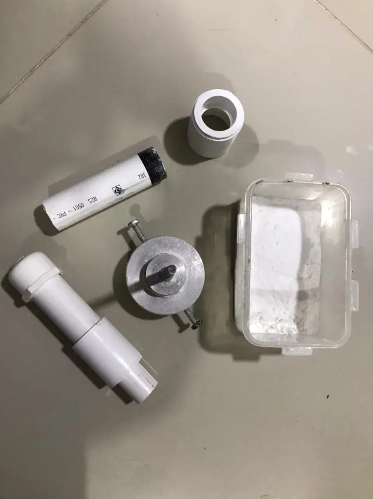
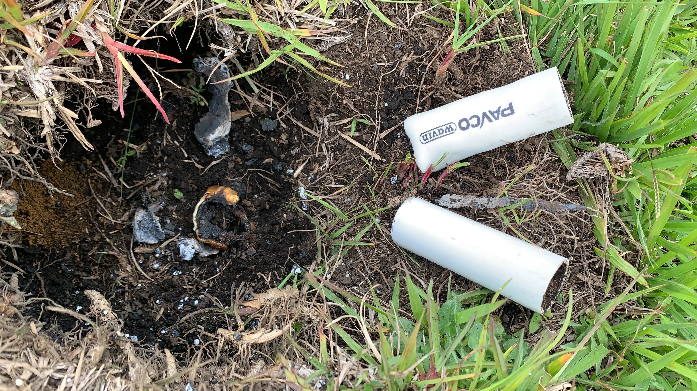
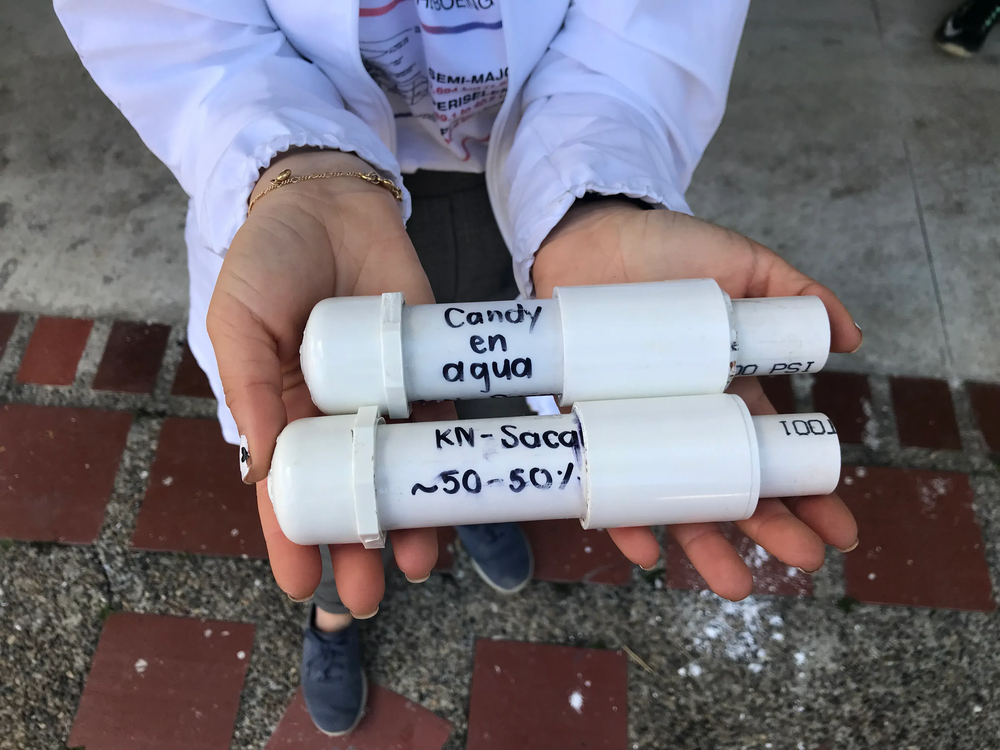
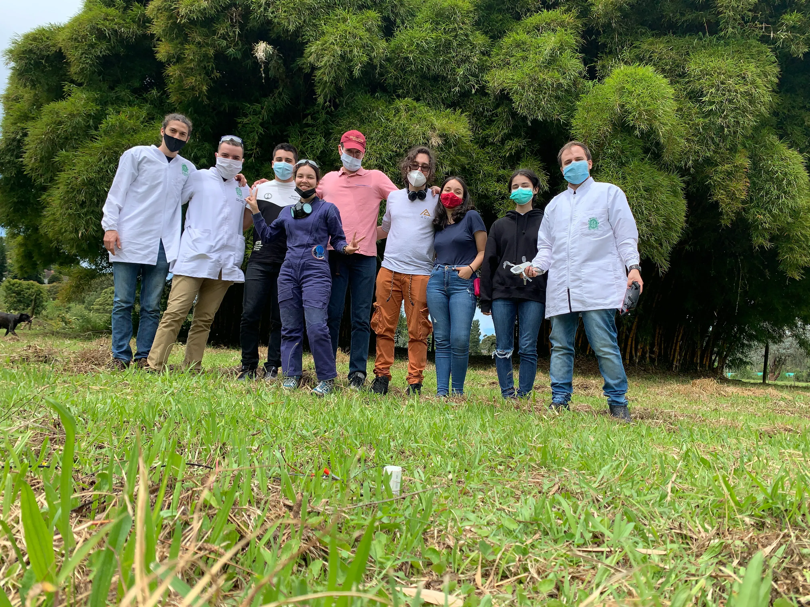

***
## ¿De qué se trata y con qué fin?*

Es el primer proyecto de la investigación en propulsión sólida para cohete que realiza el Semillero Delta-V, para así aprender y caracterizar los distintos procesos
 de manufactura y diseño de motores de propelente sólido para cohetería amateur, buscando que el semillero tenga una fuente confiable, constante y económica de estos motores.
***

***

## ¿Como?
Con el apoyo del grupo Astra, y la institucionalidad de la Universidad de Antioquia, se han llevado a cabo las primeras etapas de investigación y pruebas.

***

***

## El equipo

- Laura Duque
- Maria Alejandra Botero
- Camilo Sierra Otero
- Manuela Zapata Quirós
- Juan Diego Infante
- Lina Solano
- Felipe Burbano
- Samuel López Zapata
- Nicolás Buriticá
- Juan José Mejía
- Santiago Vélez Casallas
- Jorge Mario Serna
- Julio Salazar Taborda

