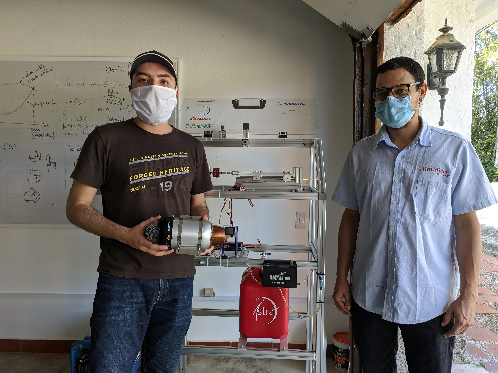

***

## ¿De qué se trata?

Relacionar compuestos químicos en los gases de combustión que salen de la turbina con parámetros de desempeño y tipo de combustible como presión, temperatura, consumo específico, eficiencia, etc..

***
## ¿Con qué fin?

Profundizar en conocimiento de compuestos químicos en el combustible y en los gases de escape y su relación con el desempeño de las turbinas. Probar diferentes combustibles de baja presencia en el mercado actual y de alto potencial de uso en el futuro teniendo en cuenta la presencia de gases contaminantes, siendo este un factor de gran importancia en la regulación de nuevos combustibles para aeronaves.

***
## ¿Cómo?
Se usará un analizador de gases de combustión por celda electroquímica para identificar parámetros químicos y físicos del flujo de gases como O2, CO, CO2, Nox, So2, Exceso de aire, Eficiencia de combustión, temperatura en gases de salida, presión en gases de salida y se variará la potencia de prueba y el combustible para relacionar con datos obtenidos con el analizador y poder trazar una ruta de profundización en uso de nuevos combustibles.

***
## Project Managers
Mario Silva

***
## Conoce al equipo
- Angélica Turizo
- Jorge Serna, Samuel López
- Mario Silva
- Juan José.

